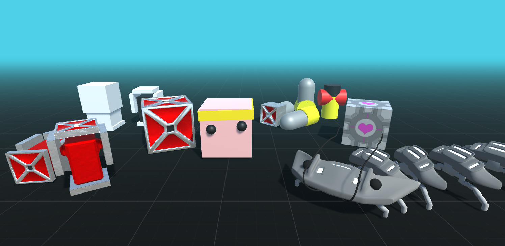

# EMR: Evolving Modular Robots - Unity



## Overview

Evolving Modular Robots (EMR) is a package that can be used for evolving modular robots in the Unity gaming engine. It uses the ML-Agent's toolkit for creating and evaluating robots in Unity. The current project only supports evolving tree-based (chain-based) robots, meaning that robot components have a hierarchical dependency. 

This package comes with three examples: (1) a modular robot approach (2) evolving virtual creatures that are like Karl Sim's seminal work on Evolving Virtual Creatures, and (3) a paleobot robot that resembles a trilobite. Robots are created by interpreting a `blueprint` (or `genome`). The python package of this project produces these blueprints. These blueprints are sent to Unity over a []`side-channel` and interpreted into robots (ml agents) in Unity. To construct a robot in Unity, the graphs sent to Unity need to contain information of the type of module that should be constructed. One can change and incorporate new modules easilty using the `robot_module` helper scripts. The three robot examples in the project can be used as test robots and serve as illustrative examples of how users can co-optimize the body and brain of robots with Unity using evolutionary algorithms.

The purpose of this package is to have a testbed for analyzing graph-based agents can be evolved in simulation environments. Here are some projects evaluating the effect of [compliance](https://direct.mit.edu/isal/proceedings/isal2023/35/76/116931), [encodings](link), [morphological protection(will be published soon](link) and [decentralized control schemes](https://direct.mit.edu/isal/proceedings/isal2022/34/49/112308) on evolving modular robots.

# Content

[Prerequisites](#1-Prerequisites)

[Installation](#2-Installation)

[Getting Started](#3-Getting-Started)

[Making your own modules](#4-Making-your-own-modules)

[Writing your own operators](#5-Writing-your-own-operators)

## 1 Prerequisites

This project requires `Python v3.7 <= v3.9` (3.9.16 for a specific version that works) and `mlagents v0.29.0`. (Note that currently the project is sensitive to using packages of different versions).

You can use this project either with precompiled executables, or you can make your own executables using the Unity Editor. You can use the precompiled executables if you don't want to change anything in the simulator and would like to use one of the example environments. Precompiled executables can be download from: [https://www.mn.uio.no/ifi/english/research/groups/robin/events/Tutorials/Tutorial%20-%20Artificial%20Life%20-%202023/unity-builds/](https://www.mn.uio.no/ifi/english/research/groups/robin/events/Tutorials/Tutorial%20-%20Artificial%20Life%20-%202023/unity-builds/). The executables can be run on windows and linux (macOS is being tested).

If the user would like to change details of the simulator (e.g. to adjust the physics, change the environment or change the modules) or by downloading and installing the package for Unity. The latter approach requires `Unity version 2022` and `Unity MLAgents version 2.0.1`. The package used for this project can be found in the unity_package folder of this repository.

## 2 Installation

This project can be run through (1) the Unity `editor`, or (2) a standalone application that can simulate robots without editor functionality. The first approach should be used for developing and debugging any algorithms in Unity, while the second can be used for deploying experiments using the Unity package.

---

### Option 1: Installing a standalone executable through python using the package

The recommened installation approach for this project is to first clone this git repository. The EMR folder of this repository contains a pip package that can be installed by using `pip install <path_to_EMR_folder>`. Note that this project requires Python version >= `3.10.1`, <=`3.10.12`. When installing this package, we recommend that you make a new `virtual environment` to install python packages in. For setting up a virtual environment you can follow the instructions [here](https://docs.python.org/3/library/venv.html).

Once the package is installed you can install a compiled executable that can accompany the program using the commands below. The download utility will fetch the correct executable from the University of Oslo's website and adds the executable to the current working directory.  

```python
>>> from emr.utility import download as dl
>>> dl.download()
```
Once the download has been completed, the executable can easily be run by the emr package. By default, the executable is stored in the working directory in a newly generated folder called `EMR_Executable`. The executable itself is called `EvolvingModularRobots` and has a specific extension depending on your operating system.

If the download utility did not work, you can still go to the following website to download the standalone executables: [UiO ALife Tutorial website](https://www.mn.uio.no/ifi/english/research/groups/robin/events/Tutorials/Tutorial%20-%20Artificial%20Life%20-%202023/unity-builds/). 

> MacOS users might need to run the command `xattr -rc [PATH_TO_APP]` before the executable can be run. 

The executable is used from the python project and you will need to supply the path to the `Unity Executable` in the configuration file. This can be done by overwriting the respective part of the config file in python through `config['experiment']['executable_path'] = <PATH_TO_EXECUTABLE>`. See the code example in `getting started` for an illustration.

---

### Option 2: Running in the Unity Editor
If you would like to change the simulator either by adding/changing modules, or experimenting with new algorithms, you import the Unity package in the Unity Editor. The Unity editor can be downloaded from the official Unity website and Unity MLAgents can be downloaded through the package manager. To use the modules designed for this project, you can download and import the `EvolvingModularRobotsVanilla.unitypackage` file located in the `UnityPackage` folder of this repository.

In the Unity editor, you can import the package by going to `Assets->Import Package`. After importing the package, you can test the project by opening one of the following `scenes`: (1) `ModularRobotsScene` (2) `SimsScene` (3) `Paleobot`. You can press the `Play` button and press `R` on the keyboard to create a few random robots. You can build a standalone application for this package that can be adjusted how the user sees fit by building it in Unity (`ctrl + b`). For windows this will automatically create a `.exe` that you can load from Python. (linux and macos build support might need to be downloaded). To run the script in editor mode, you'll have to specify this in the config file by changing the `[run_in_editor_mode]` entry which is set to `0` (False) by default.  simply run the script, and then press play in Unity. If all went well, you should see random modular robots pop up. What is happening is that there is now an evol utionary algorithm sending blueprints to Unity that are interpreted as modular robots.

## 3 Getting Started

### 3.1 Generating random robots

You can test whether the executables work by running them and following the instructions. You can press '1','2' and '3' on your keyboard to load the different robot scenes. When you loaded a scene, you can press 'r' and the simulation will generate a random graph. If this doesn't work, there is an issue with the executable.

### 3.2 Testing the functionality of the package

To test whether the project is good to go for evolving modular robots, it is adviceable to run one test script that will evaluate whether all the functionality works as it is supposed to. In `emr.utility` there is a python script called `tests`. This script contains five tests that you can run to see whether everything is up and running. Make sure you have downloaded the `Unity Executable` before running the tests (See [Installation](#2-Installation)).

You can either run this test directly in the terminal through: 

```python
>>> from emr.utility import tests
>>> from emr.config import config_handler
>>> cfg = config_handler.make_config()
>>> cfg['experiment']['executable_path'] = "PATH_TO_UNITY_EXECUTABLE"
>>> tests.run_all_tests(cfg, headless = True)
```

Or you can create a short test script like

```Python
from emr.config import config_handler
from emr.utility import tests

if __name__ == "__main__":
    cfg = config_handler.make_config()
    cfg['experiment']['executable_path'] = "PATH_TO_UNITY_EXECUTABLE"
    tests.run_all_tests(cfg, headless = True)
```

You can set the headless argument to `False` to see Unity being opened and generating random individuals for the tests. 

### 3.3 Running an experiment using DEAP

The project uses the DEAP library to evolve modular robots. To run an example experiment, you can use the python package and call the evolutionary algorithm. To run the evolutionary algorithm, you will need to specify a reference to the controller that is being used, the encoding, and the evaluation function.  

```python
import emr as emr
from emr import encoding, controller, environment, evolution, config
from tqdm import tqdm

# The following three references will be registered in the evolutionary algorithm

# specify the encoding to use (reference to object)
encoding_reference = encoding.LSystem.GraphGrammar
# specify the controller to use (reference to object)
controller_reference = controller.phase_coupled_oscillator.PhaseCoupledOscillator
# specify the evaluation functin to use (reference to function)
evaluation_function_reference = environment.evaluation.evaluate_individual

if __name__ == "__main__":
    cfg = config.config_handler.make_config()
    # the default config does not know where you downloaded or build any Unity executables. The .exe or .x86 extensions of the builds should not be included. The path might need to be absolute.
    cfg['experiment']['executable_path'] = "PATH_TO_THE_EXECUTABLE"
    # Save and load the config files with the helper functions commented out below. 
    #config.config_handler.save_config("config.cfg", cfg) 
    #cfg = config.config_handler.load_config("config.cfg") 

    # Fetching the modules that can be used 
    modules_to_use = config.config_handler.modules_to_use(cfg)

    # creating a standard evolutionary algorithm that using `deap` 
    ea = evolution.deap_interface.EvolutionaryAlgorithm(evaluation_function_reference, cfg, encoding_reference, controller_reference, modules_to_use, n_cores = 1)
    
    # run an evolutionary experiment
    ea.initialize(cfg)
    for _ in tqdm(range(1), "Generation: "):
        ea.epoch()
    # close any environments (especially important on linux and mac)
    ea.close()
```

When running this script, the evolutionary algorithm will by default save the

### 3.4 Recording and Loading Evolved Robots (WIP)

When loading an individual that was optimized on a machine different from your current one, the performance might differ. If the different machine was a HPC solution without a graphical user interface, one can still record the individual in the simulation. The record function returns a JSON recording file that can be associated with the individual. The contents of this JSON recording can be send over the `side-channel` which will prompt the executable to play the recording instead of running the physics simulator. Any inputs sent from Python to the robot during this replay will be ignored.

### 3.5 

For more functionality examples, have a look at the `ExampleScripts` folder.

## 4 Making your own modules

To make your own modules you should make your own executable using the Unity Editor. The robot package can be imported in the editor as explained in section [running in the editor](*Running-in-the-Unity-Editor). Once the package is imported, navigate to the EvolvingModularRobots folder. Here you will find all the files used that made the Unity `Builds`. In order to make your own modules, have a look at a `prefab` such as the `EmergeModule` (originally derived from the [Èmerge](https://www.frontiersin.org/articles/10.3389/frobt.2021.699814/full modular robot system by Moreno and Faiña). This prefab contains one script called Module which is a helper script that allows Unity to easily assemble a robot from modules containing this script.

### Module script

The `Module` C# script contains a few references to connections sites, joints, and colliders. The emerge module has for example 3 connection sites (CSs; the location of new child modules), and one parent connection site (CSP). The emerge module furthermore contains two colliders with a configurable joint in between. The first collider contains a joint representing the servo motor of this module and the second collider contains a joint that will be used to attach the module to another joint. Lastly, the module contains a game object called `CollisionChecker`. This object is used to check whether the module overlaps with any other object once it is created (using a box collider with `IsTrigger = True`; note that this collider is positioned slightly above the CSP [connection site parent]). To get started creating your own module, it is easiest to simply duplicate the emerge module and alter it to how you see fit.


### Adding a module to the ModularRobot script

In order for new modules to be incorporated in the evolutionary algorithm, you will need to specify that the new modules should be incorporated. This needs to be specified both in a Unity Scene and in a Python Script. To understand this process open the `ModularRobotScene` from the imported package. This scene contains a few objects, a GameManager, an Individual and a Plane. The Individual object is a singleton like the GameManager. It contains a script called ModularRobot which derives from Animat which derives from MLAgents.Agent. This script contains an list entry called `Component Prefabs To Use`. Any new modules or module variants can be added to this list by dragging and dropping a module prefab. To test whether the newly added modules work, you can Start the scene in Unity and press 'R' on your keyboard a few times to see whether random robots are correctly being created. If no error pops up in the Unity console, it should be possible to evolve robots using the new module(s).

### Adding a module to the Python code

In the python scripts the encoding scripts responsible for making robot graph blueprints need a reference to the modules that are available in the simulor. This is a dictionary referencing `{[modulename : str] : [ModuleInformation]}`. Here, ModuleInformation (found in `emr.config_handler`) is a tiny helper object that requires knowledge on how many child connection sites there are in the new module and whether this module has a controller (whether it will need to be actuated). In python you can create or add to a `modules_to_use` dictionary by adding a key with the instance to the ModuleInformation object. So say you designed a new module with 6 possible connection sites, you can call write the following code. The key value of the dictionary should correspond with the name you gave the module inside Unity.

```Python
# Specify module parameters
module_name = 'NAME_OF_MODULE'
number_of_connection_sites = 6
# Create instance of helper object
module_information_instance = emr.config_handler.ModuleInformation(module_name,number_of_connection_sites,hasController=True)
# make the dictionary
modules_to_use_dictionary = dict()
modules_to_use_dictionary.update({module_name:module_information_instance})
```

## 5 Writing your own operators

When using the python package, a few references to classes have to be passed on to the evolutionary algorithm. These references can be replaced with anything but to ensure there will not be any errors, make sure the classes are inheriting from the respective abstract classes. E.g. if you would like to implement a different type of controller, make sure to inheret from the `AbstractController` class located in the controller folder in the emr package. The abstract classes will require you to implement a certain set of functions that ensures all everything can still work together.

### Writing your own `evaluation function`

There is currently one evaluation function that is being used called `evaluate_individual`. This function (1) gets the environment and side-channel, (2) gets a graph generated by the encoding, (3) innervates the generated graph with a decentralized control approach, (4) creates the individual, (5) evaluates the individual in simulation, and (6), returns a fitness value. This function is located in emr.environment.evalution.py, when writing your own evaluation function references to `get_env` are inside this evaluate.py so make sure to import it.

```python

def evaluate_individual(ind, executable_path : str, scene_number_to_load : int = 1, n_duplicates = 1, n_steps : int = 500, 
                        time_step : float = 0.01, no_graphics : bool = False, editor_mode : bool = False, debug : bool = False, record : bool = False) -> float:
    fitness = -1
    global env 
    global channel
    for _ in range(n_duplicates):
        # Get the singleton environment and side-channel
    
        env, channel = get_env(path_to_unity_exec=executable_path,scene_number_to_load=scene_number_to_load, no_graphics= no_graphics, editor_mode=editor_mode)
        if (record):
            # Tell Unity to record this individual
            channel.send_string(f"Record,True,")
    
        robot_graph = ind.get_graph()
        ns = decentralized_controller.innervate_modules(robot_graph)
        # Reset the environment and make the robot
        created_module_keys = create_individual(env,channel,robot_graph=robot_graph, debug = debug, record = record)
        # Step through the simulation for the given number of steps 
        fitness = evaluate_individual_in_simulation(robot_graph = robot_graph,created_module_keys = created_module_keys, n_steps = n_steps, delta_time = time_step)
        if (record):
            # prompt Unity to return recording to python
            channel.send_string(f"Done")

    ind.fitness = fitness
    return fitness

```

Deap contains multi-objective evolutionary algorithms that can be utilized by returning multiple fitness values after evaluating an individual. In order to accomplish this, you will need to rewrite parts of the evolutionary algorithm of this package. 

### Writing your own `encoding` (WIP)

```python

```

### Writing your own `controller` (WIP)


```python

```

### Writing your own `optimizer` (WIP)

```python

```

## Roadmap

- Sensors are not completely functional in the current approach but we intend to incorporate an interface with a set of simple sensors.
- Currently shapes require box colliders. Support for other colliders is under development. 

### Known issues

- When running on linux operating systems, there is an excess of logged information "Unloading unused assets". This makes it difficult to trace any potential bugs. Let us know if you are aware of a method that can suppress these unwanted logs. 

## Collaborators

This project was developed by Frank Veenstra and contributors Emma Stensby Nordstein, Kyrre Glette, Tobias Remman Paulsen, Mia-Kathrin Kvalsund, and Joergen Nordmoen. Mia-Kathrin's and Tobias' MSc. projects using this simulator can be found in : [TODO: add link](link). Emma Stensby's project evaluating springs when evolving modular robots : [TODO: add link](link). 

## Referencing

If you are using this package for your research you can cite any of our previous articles that is most relevant to your research. There is no general article of this package yet (stay tuned) but you can of course also reference this github repository through using:

```
@online{Veenstra2023,
    title = {Evolving Modular Robots in Unity (\url{https://github.uio.no/frankvee/EvolvingModularRobots_Unity})},  
    author = {Frank Veenstra},  
    year = {2023},
    url = {https://github.uio.no/frankvee/EvolvingModularRobots_Unity}
}

```

Since this project uses the ML-Agents Toolkit, you can find how the creators of this toolkit would like to be referenced on their github page : [https://github.com/Unity-Technologies/ml-agents](https://github.com/Unity-Technologies/ml-agents)

## Feedback and Support

Feel free to reach out to us if you'd like some feedback or support!
